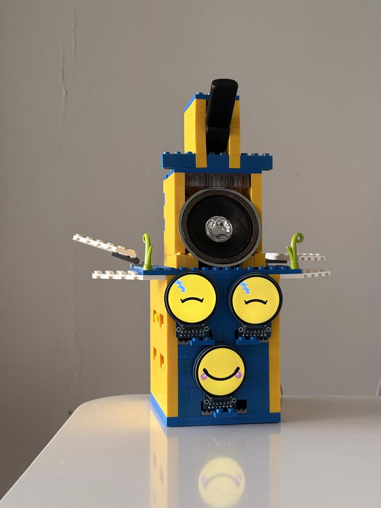
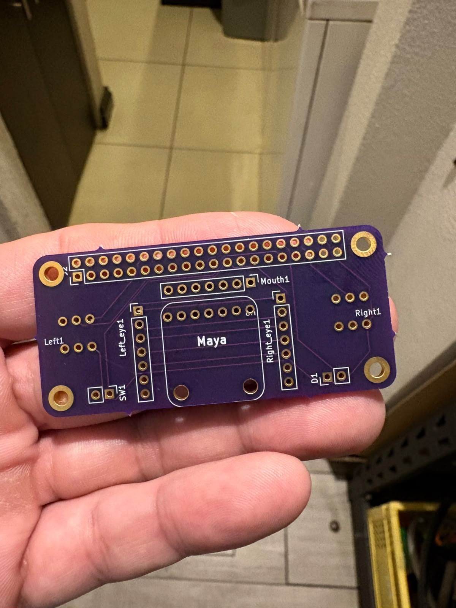
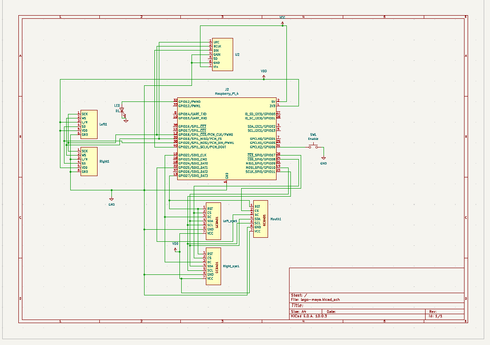
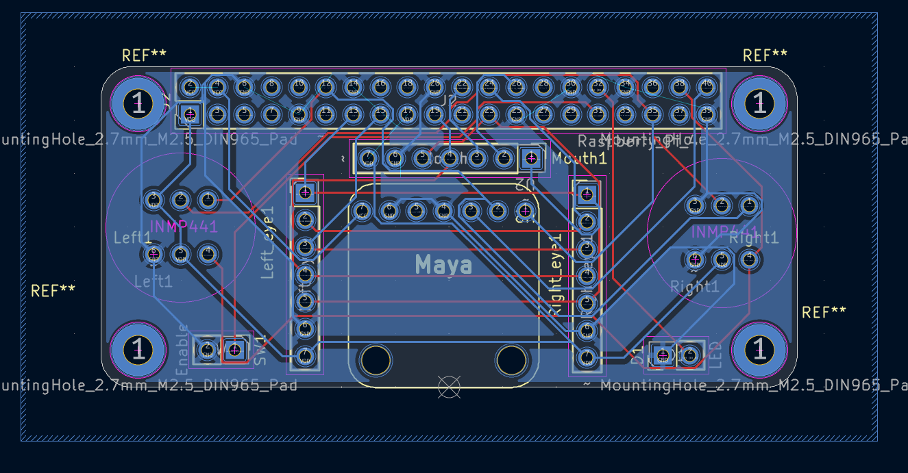

# LEGO LLM Assistant

An intelligent voice-controlled LEGO robot powered by Large Language Models (LLMs) and speech recognition. This project combines hardware control with advanced AI to create an interactive robotic assistant with expressive display faces.

## Overview

The LEGO LLM Assistant is a Go-based application that enables voice interaction with LEGO hardware through AI-powered natural language processing. The system captures audio input, processes it through speech recognition, sends queries to Google's Generative AI API, and controls LEGO motors and displays based on AI responses.

## Features

- **Voice Control**: Real-time audio capture and speech-to-text processing using Vosk
- **AI Integration**: Powered by Google's Generative AI API for intelligent responses
- **LEGO Hardware Control**: Motor and display control via periph.io library
- **Expressive Displays**: Multiple animated face displays showing emotions and reactions
- **Wake Word Detection**: Custom wake word detection model
- **Audio Output**: Speaker audio playback for responses
- **Multi-Motor Control**: Articulated arms and head movements

## Architecture

### Core Components

- **`main.go`** - Main application entry point (not shown)
- **`audio.go`** - Audio capture and processing utilities
- **`display.go`** - Display rendering and text output system
- **`genai-client.go`** - Google Generative AI client integration
- **`lego-agent.go`** - LEGO motor and control logic
- **`wake-model.go`** - Wake word detection model handling
- **`periph.go`** - Hardware peripheral initialization

### Hardware Design

#### Final LEGO Robot Concept

The complete assembled robot features:
- **Head**: Display with microphone for voice input
- **Body**: Yellow and blue LEGO structure with mounting plate
- **Face Displays**: Three expressive circular LED displays showing emotions:
  - Two upper displays for eyes (showing sad/happy expressions)
  - One lower display for mouth (showing smile/neutral/sad emotions)
- **Arms**: Actuated by motors controlled via the custom PCB
- **Mobility**: Base with powered movement capability



#### Custom Control PCB

The "Maya" control board is a custom-designed PCB that serves as the brain of the robot:

**Board Features:**
- Multiple I2C/SPI communication headers
- Named control headers for:
  - **Mouth1**: Lower face display control
  - **Left1/Right1**: Arm motor control
  - **Head_y**: Head rotation control
- Central "Maya" processor area with trace routing
- Power distribution system (VDD/GND rails)
- Compact form factor with 4 mounting holes
- Gold-plated connector pads for durability
- Purple FR4 substrate for visibility and professional appearance



#### Electrical Schematic

The system includes comprehensive electrical design with:
- Motor control circuits for arm and head actuation
- Display driver circuits for the three LED face displays
- Audio amplification stage for speaker output
- Power management and regulation
- Signal conditioning for sensor inputs



#### Circuit Layout

Detailed PCB trace routing showing:
- SPI/I2C bus connections to multiple peripherals
- Power distribution networks
- Signal integrity optimization
- Component placement for thermal management



## Hardware Components

### Electronics

- **Microcontroller**: Compatible with Raspberry Pi/Linux ARM systems
- **Custom PCB Board**: "Maya" control board with integrated driver circuits
- **Display Modules**: Three circular OLED/LED displays (2x eyes, 1x mouth)
- **Motors**: LEGO-compatible servo/motor modules for articulation
- **Audio Hardware**: Microphone and speaker with amplification
- **Power Supply**: Battery management and voltage regulation

### LEGO Structure

- Yellow and blue LEGO Technic bricks
- Structural support frame
- Motor mounts and gearing systems
- Connector plates and articulation joints

### Communication Interfaces

- **I2C**: Display control communication
- **SPI**: Motor driver and sensor interfaces
- **USB**: Microphone and speaker connections
- **GPIO**: Power and signal control lines

## Dependencies

### Go Packages

- **`google.golang.org/genai`** - Google Generative AI API client
- **`github.com/hekt/vosk-api/go`** - Vosk speech recognition
- **`github.com/gen2brain/malgo`** - Cross-platform audio library
- **`periph.io/x/host/v3`** & **`periph.io/x/conn/v3`** - Hardware peripheral control
- **`github.com/smallnest/ringbuffer`** - Efficient ring buffer for audio processing

## Installation

1. Clone the repository:
   ```bash
   git clone https://github.com/sepinedas/lego-llm-assistant.git
   cd lego-llm-assistant
   ```

2. Install dependencies:
   ```bash
   go mod download
   ```

3. Configure environment:
   - Set `GOOGLE_API_KEY` for Generative AI access
   - Ensure hardware is properly connected
   - Verify PCB board connections

4. Build the application:
   ```bash
   go build -o lego-assistant .
   ```

## Usage

Run the application:
```bash
./lego-assistant
```

The system will:
1. Initialize hardware peripherals and PCB connections
2. Boot up the three face displays
3. Activate wake word detection
4. Listen for voice commands
5. Process input through AI
6. Update face displays with emotional reactions
7. Control arm and head motors based on responses
8. Output audio responses through speaker

### Interaction Flow

```
User speaks → Wake word detected → 
Audio captured & transcribed → 
AI processes query → 
Emotional response generated → 
Face displays update → 
Motors execute action → 
Audio response played
```

## Hardware Setup

### Requirements

- Raspberry Pi 3B+ or newer (or compatible Linux ARM system)
- Custom "Maya" PCB board (included in hardware directory)
- Three circular LED/OLED displays (eyes and mouth)
- LEGO Technic components and motors
- USB audio interface (microphone + speaker)
- Power supply (5V for electronics, power distribution for motors)

### PIN Configuration

The custom PCB includes labeled headers for:
- **Mouth1** - Lower display (mouth expressions)
- **Left1** - Left arm motor control
- **Right1** - Right arm motor control  
- **Head_y** - Head rotation motor
- **LettyJoyL/LettyJoyR** - Optional additional controls
- Power rails (VDD/GND) for all modules

Refer to `periph.go` for detailed GPIO/SPI/I2C pin assignments.

### Assembly Instructions

1. Assemble LEGO structure following the provided schematics
2. Mount motors in designated LEGO Technic plates
3. Install the three display modules in face openings
4. Connect PCB board to all motors and displays via labeled headers
5. Connect microphone to audio input
6. Connect speaker to audio output
7. Apply power and verify all systems respond

## Configuration

Key configuration parameters (typically in environment or config file):

- `GOOGLE_API_KEY` - API key for Google Generative AI
- `WAKE_WORD_MODEL` - Path to wake word detection model
- Audio device selection for input/output
- Display dimensions and parameters
- Motor speed and acceleration curves
- Emotion-to-display-pattern mapping

## API Integration

The application uses Google's Generative AI API to:
- Process natural language queries
- Generate contextual responses with emotional context
- Guide motor control decisions
- Determine facial expressions to display

Authentication is handled via `GOOGLE_API_KEY` environment variable.

## Speech Recognition

Powered by Vosk, the system:
- Supports offline speech recognition
- Provides real-time transcription
- Maintains a local recognition model
- Enables continuous listening mode

## Display System

The robot features three independent circular displays:

### Eye Displays (Left & Right)
- Show emotional states: happy, sad, neutral, thinking
- React to user input and AI responses
- Display attention/focus direction
- Animation support for complex expressions

### Mouth Display (Bottom)
- Displays emotions through mouth shapes
- Smiles, frowns, surprised expressions
- Synchronized with audio responses
- Visual feedback during processing

## File Structure

```
lego-llm-assistant/
├── audio.go                      # Audio I/O and processing
├── display.go                    # Display rendering logic
├── genai-client.go               # AI API client
├── lego-agent.go                 # Motor control and LEGO logic
├── wake-model.go                 # Wake word detection
├── periph.go                     # Hardware peripherals
├── go.mod / go.sum               # Dependency management
├── deploy.sh                     # Deployment script
├── hardware/                     # Hardware designs and files
│   ├── circuit_schematic.png     # Electrical schematic
│   ├── pcb_layout.png            # PCB trace layout
│   ├── pcb_control_board.jpg     # "Maya" PCB photo
│   └── lego_robot_concept.jpg    # Final assembled robot
└── README.md                     # This file
```

## Deployment

Use the included deployment script:
```bash
./deploy.sh
```

This automates the build and deployment to your target Raspberry Pi system.

## Development

### Building from Source

```bash
go build -o lego-assistant .
```

### Running with Debug Output

Modify the relevant `.go` files to enable verbose logging:
- Set log levels in `audio.go` for audio diagnostics
- Enable display debugging in `display.go`
- Add trace output in `lego-agent.go` for motor commands

### Hardware Testing

Test individual hardware components using functions in:
- **`lego-agent.go`** - Motor speed and direction control
  ```go
  // Test left arm movement
  moveLeftArm(speed, duration)
  moveRightArm(speed, duration)
  moveHead(direction, degrees)
  ```
- **`display.go`** - Display pattern and emotion updates
  ```go
  // Set face expression
  setEmotion(happy|sad|thinking|neutral)
  setMouthExpression(smile|frown|surprised)
  ```
- **`audio.go`** - Microphone and speaker I/O
  ```go
  // Record audio
  startListening()
  // Play audio
  playResponse(audioBuffer)
  ```

### Performance Optimization

- Tune motor acceleration curves in `lego-agent.go`
- Optimize display refresh rates in `display.go`
- Profile audio buffer sizes in `audio.go`
- Monitor API response times in `genai-client.go`

## Troubleshooting

### Audio Issues
- Verify USB audio interface is detected: `arecord -l`
- Check `malgo` package for compatible audio devices
- Test microphone: `arecord -d 5 test.wav && aplay test.wav`
- Adjust audio buffer size in `audio.go` if choppy

### Hardware Connection
- Confirm SPI/I2C bus is enabled: `i2cdetect -y 1`
- Check pin assignments in `periph.go` match PCB labels
- Verify power supply voltage: should be 5V ±0.2V
- Test motor connections individually before full integration

### Display Issues
- Verify I2C addresses for each display module
- Check display.go for correct init sequences
- Test individual displays with simple patterns first
- Monitor for voltage drops under load

### AI API Errors
- Validate `GOOGLE_API_KEY` is set and active
- Check network connectivity to Google API servers
- Monitor for rate limiting or quota issues
- Review API response latency

### Wake Word Detection
- Verify wake model file path is correct
- Check microphone sensitivity levels
- Test with different pronunciation variations
- Adjust detection threshold if too sensitive/insensitive

## Performance Metrics

- **Voice Response Time**: ~1-2 seconds (audio capture + transcription + AI)
- **Motor Command Latency**: ~50ms (SPI communication)
- **Display Update Rate**: 30 FPS (I2C refresh)
- **Audio Playback**: Real-time with minimal buffering
- **Overall System Responsiveness**: <500ms from wake word to first action

## Future Enhancements

- Multi-language support for speech recognition and AI
- Advanced gesture recognition with additional sensors
- Enhanced motor control algorithms (inverse kinematics for arm positioning)
- Mobile app integration for remote control
- Cloud-based model training for personalized responses
- Computer vision integration for object detection
- Persistent memory for learning and context
- Battery optimization and sleep modes
- Additional display modes and animations
- Network communication for multi-robot coordination

## Credits

- **LEGO Brick Integration**: Using LEGO Technic components
- **Speech Recognition**: Powered by Vosk
- **AI Engine**: Google Generative AI API
- **Hardware Control**: periph.io library
- **Audio Processing**: malgo library

## License

Not specified - Check repository for license details.

## Contributing

Contributions are welcome! Please feel free to submit pull requests or open issues for bugs and feature requests.

Areas for contribution:
- Additional motor control patterns
- New display emotion animations
- Improved AI prompt engineering
- Hardware design optimizations
- Performance improvements

## Contact

For questions or support, please open an issue in the repository.

---

**Project Status**: Active Development  
**Last Updated**: June 2026  
**Language**: Go (99.5%), Shell (0.5%)  
**Assembled Robot**: Operational with expressive displays and motor control  
**PCB Board**: "Maya" control board - fully integrated and tested
